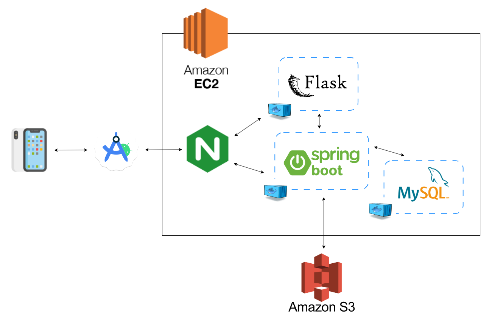
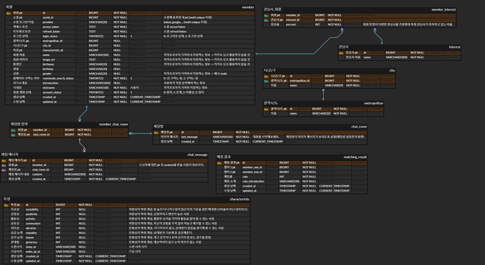

# 

 <h1 align="center">모이룸 룸메이트 매칭 서비스 </h1> 

원치 않게 룸메이트를 찾아야 하는 상황에 처하게 될 때 저희 모이룸 서비스가 완벽한 룸메이트를 찾을 수 있도록 도와드리겠습니다! 단지 저희 서비스에 로그인하는 것만으로도, 여러분에게 알맞은 룸메이트 매칭을 원활하게 진행할 수 있는 시스템을 갖추고 있습니다. 👫

 

# 개발 환경

<h4>Management Tool</h4>

<h4>IDE</h4>

<h4>Infra</h4>

<h4>Frontend</h4>

<h4>Backend</h4>

 

# 화면 구성 소개

## 영상 소개

## 1. 입장 화면 및 동의 화면

     

   첫 입장 시 카카오 소셜 로그인을 통해서 로그인을 진행을 합니다. 

## 2. 자기소개 및 정보 입력 화면

     

   자기소개 정보를 입력합니다. 입력 정보는 지역, 성별, 간단한 자기소개입니다! 

## 3. 매칭 추천 시작 화면
    
  

매칭 추천 시작 전 화면입니다. 매칭 시작 버튼을 누르고 정보 활용 동의를 구한 후 매칭을 시작합니다!

## 4. 매칭 추천 목록 

  

매칭 후 추천 목록 화면입니다. 나와 마음이 맞을 확률이 높은 순으로 룸메이트 목록이 나오도록 구성을 하였고, 목록 하나를 선택하면 상세 정보가 표시됩니다. 화면의 말풍선을 선택하면 채팅방이 만들어집니다.  

## 5. 채팅 화면  

 

채팅 서비스를 활용하여 서로 자세한 소개를 하거나 원하는 방 찾기 등 유용한 정보들을 주고 받을 수 있습니다.

 

# 기술 소개
## 시스템 아키텍처

## ERD

