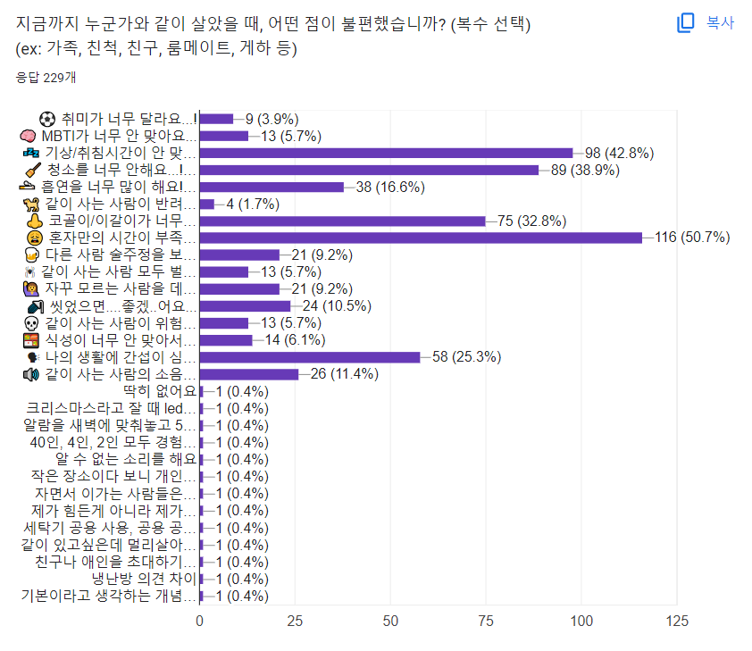
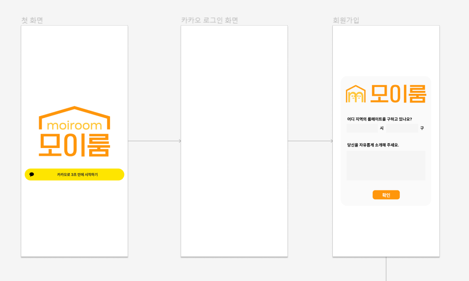
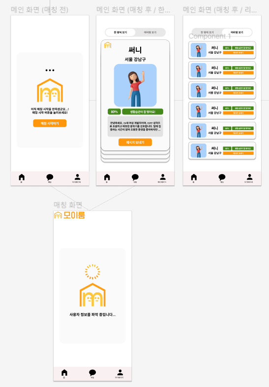
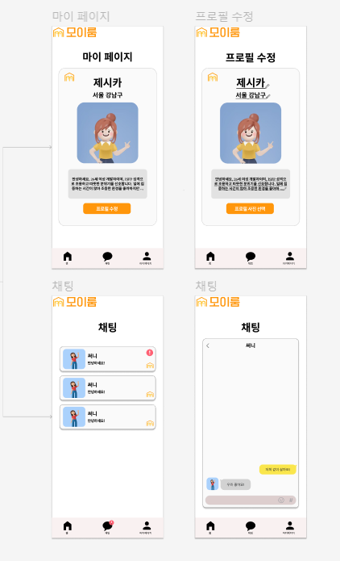

# 2024/01/08 월요일

## 프로젝트 1일차 오늘의 작업

### 아이디어 및 기획 회의
- 프로젝트 아이디어 선정
- 주 아이디어 선정 후 필요 기능 및 타당성 정리

# 2024/01/09 화요일

## 프로젝트 2일차 오늘의 작업

### 아이디어 구체화
- 주 아이디어 선정 : 사용자 기반 활동을 통해 매칭 서비스
- 구체적인 아이디어 필요

# 2024/01/10 수요일

## 프로젝트 3일차 오늘의 작업

- 모바일 개발에 관한 고민
    - 사용자 정보를 받기 위해선 모바일 개발이 필수지만, 모바일 개발 경험이 없음
    - 웹 개발을 진행하니, 얻을 수 있는 사용자 정보가 적음
- 주제 확정
    - 우선 주제부터 확정
    - 주제 : 룸메이트 매칭 서비스 개발
- 룸메 매칭 요소 고민
    - 어떤 요소로 룸메를 매칭할 지 리스트 정리
    - 밸런스 게임으로 우선 순위 선정 고민

# 2024/01/11 목요일

## 프로젝트 4일차 오늘의 작업

- 설문 조사 제작 및 진행
    - 사람들의 룸메 선정 기준이 무엇이 있고, 주로 어떤 점들을 우선적으로 확인하는지 조사
    - 설문조사 진행 결과
    
- 선정 기준 분업 및 데이터 수집 방법 조사
    - 어느 정도 혼자 있는 것을 좋아하는지 : 데이터 항목 조사, 측정 방법 조사
    - 나머지 생활적인 항목 : 흡연, 음주 등등 생활적인 항목들은 어떻게 데이터 수집 하는지 방법 조사

# 2024/01/12 금요일

## 프로젝트 5일차 오늘의 작업

- 팀 미팅 준비
    - 설문조사로 얻을 수 있는 결과는 무엇이었는지 분석
    - 느낀점
        1. 좀 더 디테일한 알고리즘이 필요하다.
            1) 설득력 있는 자료가 필요
            2) 위 자료로 어떻게 알고리즘을 매칭할지 고민
        2. 이제 속도를 내야 한다.

- 역할 분담
    - 팀 미팅을 토대로 이제 빨리 프로젝트 설계 단계로 진입해야 한다.
    - 빅데이터 알고리즘 1명, 백엔드 2명, 코틀린 3명으로 분배

- 코틀린 공부
    - 모바일 앱 개발의 필요성을 느낌
        - 웹 개발로 사용자 데이터를 얻긴 무리가 있다고 판단
        - 모바일로 최대한 사용자 데이터를 얻을 예정

- 코틀린 공부 일지
    - 개발 환경 세팅
    - 휴대폰 연결
    - 변수 정의

# 2024/01/15 월요일

## 프로젝트 6일차 오늘의 작업

- 코틀린 공부
    - 앱 화면 구성
    - 이벤트 처리

- 팀 미팅 진행
    - 좀 더 상세한 명세서가 필요
    - 사용자가 어떻게 하면 부담감을 안 느낄지 파악 필요
    - 데이터 수집 구체적인 방법 필요

- 프론트 역할 분담
    - 화면 구성 간략적인 틀 잡기

# 2024/01/16 화요일

## 프로젝트 7일차 오늘의 작업

- 와이어 프레임 전체적인 구상

- 수정 사항 정리
1. 네비게이션 바 : 홈 네이밍 다시 생각(홈이라고 하니까 매칭화면으로 넘어가는 그림이 그려지지 않음)
2. 첫 지역 선택 : 시 -> 구 넘어갈 때 화면 구상 다시 생각해보기 (시 선택하고, 화면 넘어간 다음 구 선택하는 방식)
3. 마이 페이지 : 로그아웃 버튼 구현
4. 마이 페이지 : 룸메이트 구하기 버튼 ON / OFF 구현
5. 마이 페이지 : 프로필 수정사항 저장하기 버튼 구현
6. 마이 페이지 : 성별과 이름 정보가 나와야 함
7. 메인 : 제스처로 '다시 매칭하기' 기능 생각
8. 메인(하나씩) : 카드 10개씩 보고 이전 카드, 다음 카드 화살표 구현
9. 메인(여러개) : 무한 스크롤 스크롤바 구현
10. 메인 : 성별 표시 (상대방이 모를 수 있음)
11. 매칭 화면 : 작게 tip 알려주는 알림칸 만들기 (게임처럼)
ex) 어차피 동성만 나올 것이다.
ex) off 상태에서 다시 매칭하기를 실행하면 자동으로 on으로 바뀐다.

# 2024/01/17 수요일

## 프로젝트 8일차 오늘의 작업

- 기능 명세서 완성
    - 구현해야할 기능들 정리
